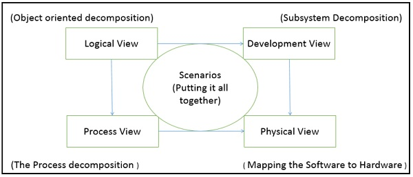

- [3 架构模型](#3-%E6%9E%B6%E6%9E%84%E6%A8%A1%E5%9E%8B)
  - [3.1 统一建模语言](#31-%E7%BB%9F%E4%B8%80%E5%BB%BA%E6%A8%A1%E8%AF%AD%E8%A8%80)
  - [3.2 架构视图模型](#32-%E6%9E%B6%E6%9E%84%E8%A7%86%E5%9B%BE%E6%A8%A1%E5%9E%8B)
  - [3.3 架构描述语言](#33-%E6%9E%B6%E6%9E%84%E6%8F%8F%E8%BF%B0%E8%AF%AD%E8%A8%80)

- 定义一个软件架构的方式包括
  - 统一建模语言(UML, unified modeling language)：面向对象的解决方案，用于软件建模和设计
  - 架构视图模型(architecture view model)，也叫 4+1 视图模型(4+1 view model)：展示软件应用的功能性和非功能性需求
  - 架构描述语言(ADL, architecture description language)：正式地从语义上定义软件架构

## 3.1 统一建模语言

- 作为软件需求分析和设计文档的标准，是开发软件的基础
- 有两种示意图
  - 结构图：描述系统的静态特点。静态部分可用类、接口、对象、组件和节点表示。结构图可分为
    - 类图：表示类之间的静态关系
    - 对象图：表示一组对象运行时关系，也描述了系统的静态视图
    - 组件图：描述系统所有组件，组件的相互关系、交互和接口
    - 部署图：一组节点和节点的关系。这些节点是部署组件的物理实体
    - 包图：描述包的结构和组织。包括一个包内的类和包内的包
    - 复合结构图：描述组件内部的结构，包括所有的类、组件的接口
  - 动作/行为图：捕获系统的动态特点，包括系统改变/移动的部分。动作图分为
    - 用例图：描述功能之间的关系，以及它们内部/外部的控制器/行动者
    - 序列图：可视化系统内完成专门功能的调用顺序
    - 通信图：和序列图一样，区别在于通信图关注对象角色
    - 状态图：表示系统的时间驱动状态变化。主要是类、接口的状态变化
    - 活动图：描述系统的控制流，包括活动和连接。流可以是顺序的、并发的、分支的
    - 交互图：包含活动图和序列图，提供系统和业务流程的控制流的总览
    - 时序图：描述状态、条件和事件消息的变化

## 3.2 架构视图模型

- 模型：对软件架构完整的、基础的、简化的描述，包括从一个角度或视角的多个视图
- 视图：表示一组相关的关注点的整个系统。用于从不同的利益共享者(比如终端用户、开发者、项目管理者和测试者)描述系统
- 4+1 视图模型：是一个强调系统不同的特点和关注点的多视图模型。标准化软件设计文档，使得设计被所有的利益共享者更好理解
- 提供 4 个基本的视图
  - 逻辑/概念视图：描述设计的对象模型
  - 进程视图：描述系统的活动，捕获设计的并发和同步特点
  - 物理视图：描述软件到硬件的映射，也反映了分布式特点
  - 开发视图：描述软件在开发环境下的静态组织或结构
- 1 个额外视图：场景视图/用例视图
  - 为软件系统的终端用户和客户设计
  - 和其他 4 个视图一起展现架构

4+1 视图的关系如下

## 3.3 架构描述语言

- 一种正式的规范语言，描述了软件特点(比如进程、线程、数据、子程序)和硬件组件(比如处理器、设备、总线和内存)
