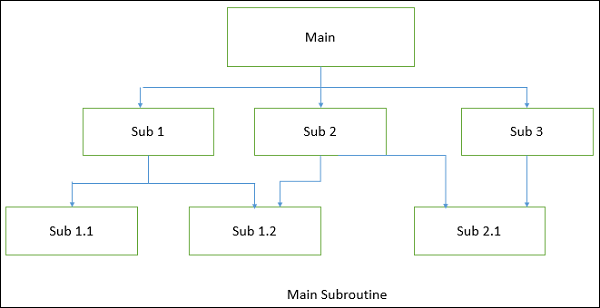
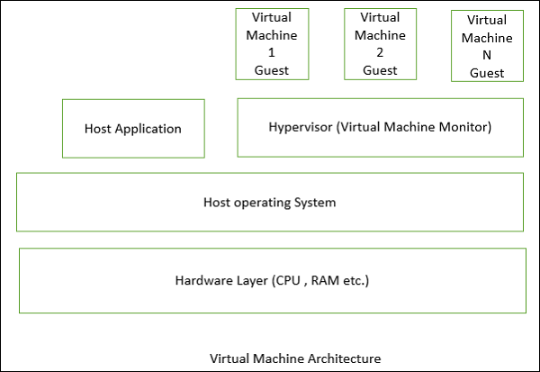

- [7.1 主子例程架构](#71-%e4%b8%bb%e5%ad%90%e4%be%8b%e7%a8%8b%e6%9e%b6%e6%9e%84)
- [7.2 主从式架构](#72-%e4%b8%bb%e4%bb%8e%e5%bc%8f%e6%9e%b6%e6%9e%84)
- [7.3 虚拟机架构](#73-%e8%99%9a%e6%8b%9f%e6%9c%ba%e6%9e%b6%e6%9e%84)
- [7.4 分层式架构](#74-%e5%88%86%e5%b1%82%e5%bc%8f%e6%9e%b6%e6%9e%84)

- 将整个系统视为层次结构，即将软件系统分为不同层次的逻辑模块或子系统
- 分类：主-子例程、主从式、虚拟机、分层式

## 7.1 主子例程架构

- 目的是复用模块，自由开发各自的模块或子例程
- 将数据作为参数传递给子例程：值传递/引用传递
- 如图
- 优点：易基于层次改进分解系统；可用于 OOD 的子系统
- 缺点：因包含全局共享数据而易受攻击；高耦合导致不易修改

## 7.2 主从式架构

- 应用分治的思想，提供系统稳定系和容错性
- 架构向主设备提供相同的服务，主设备根据选择策略从架构选取结果
- 如图
- 实现步骤：
  - 指定计算任务如何分解成一系列等价的子任务，然后指定所需子服务处理子任务
  - 指定如何根据所得子任务的结果计算整个系统最后的结果
  - 为第一个阶段的子服务定义接口。将由从设备实现，由主设备分配子任务
  - 根据上述接口实现子服务
  - 根据前三步实现主服务
- 应用：适用于可靠性比较重要的软件，广泛应用于并行和分布式计算领域
- 优点：快速计算，方便扩展；从设备可重复，提供了稳健性；从设备实现可不同以最小化语义错误
- 缺点：通信负载；不是所有问题可分割；难以实现，不易跨平台

## 7.3 虚拟机架构

- 一个虚拟机基于已有系统创建，提供一个虚拟的抽象、一系列属性和操作
- 在虚拟机架构中，主设备使用从设备相同的子服务，执行例如划分工作、调用从设备、联合结果等工作
- 如图
- 应用：适用于以下领域
  - 如果没有直接的解决方案，通过仿真或翻译解决问题
  - 样例程序，包括微程序解释，XML 处理，脚本命令语言执行，基于规则系统的执行，Smalltalk 和 Java 解释器类型的编程语言
  - 常见的例子包括解释器、基于规则的系统、句法 shell、命令语言处理器
- 优点：可移植性，机器平台独立性；简化软件开发；灵活性；仿真灾难性的工作模型；引入运行时修改
- 缺点：解释器执行慢；性能代价，因为执行中有多余的计算

## 7.4 分层式架构

- 每一层在系统中有自己单独的责任
  - 每一层包含一组相关的类，被封装成一个包，一个部署组件，或者作为一组子例程
  - 每一层为上层提供服务，并作为下层的客户端，即调用下一层的服务
- 应用：
  - 适用于包含明显的服务类的应用，可以分成层级式
  - 应用可被分成特定应用和特定平台的部分
  - 应用可清晰地分成内核服务、关键服务、用户接口服务等
- 优点：基于高层次的抽象；一层修改至多影响相邻两层；接口和实现分类；基于组件技术开发，支持即插即用；每一层可单独部署，可移植；基于任务自上而下分解；相同层的不同实现可互换
- 缺点：许多应用或系统不易分解成层级式；多层传递会降低运行时性能；数据在每层传递的负载会降低性能；层内通信可能会死锁，到底高耦合；异常和错误不易传送到所有的调用层
