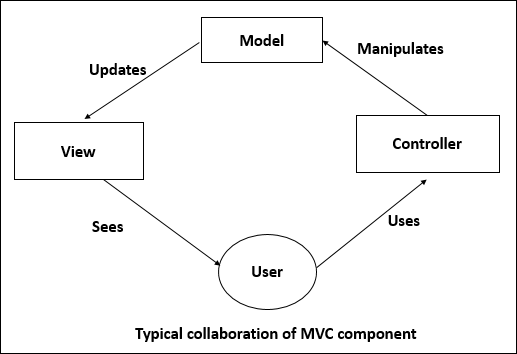
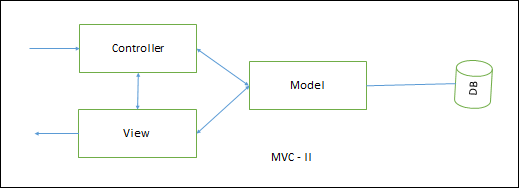
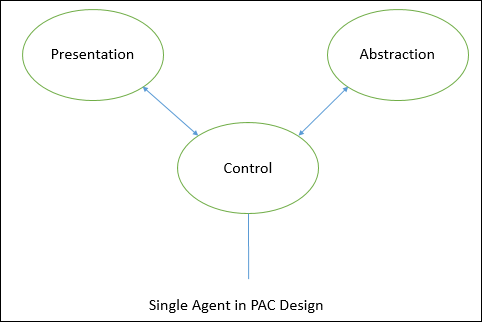
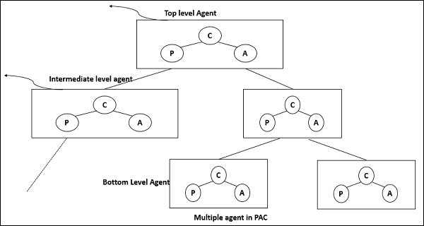

- [8.1 MVC](#81-mvc)
- [8.2 PAC](#82-pac)

- 目的：将数据层、业务数据处理和用户操作分离
- 包括三个部分：
  - 数据模块：提供数据抽象和业务逻辑
  - 控制模块：识别控制流和系统配置行为
  - 视图展示模块：负责输出数据的视觉和听觉展示，也为用户输入提供接口
- 包括两种：模型-视图-控制器(MVC, model-view-control)和显示-抽象-控制器(PAC, presentation-abstraction-control)

## 8.1 MVC

- 模型：封装底层数据和业务逻辑
- 控制器：响应用户操作，指导应用流程
  - 接收输入并转换成给模型或视图的命令
  - 作为相关命令、视图和输入设备的接口
  - 可发送命令给模型，更新模型的状态
  - 也可发送命令给相关的视图，改变视图的展示
- 视图：格式化模型的数据并展示给用户
- 如图
- 可分为
  - MVC-I
    - 如图
    - 模型模块通知控制器-视图模块数据的变化，随之改变对应的图形化数据展示
    - 模型模块提供所有的数据和域服务
    - 二者的连接可以是订阅-通知式的，即控制器视图订阅模型，模型将变化通知给控制器-视图
  - MVC-II
    - 如图
    - 视图层展示数据
    - 控制器接收输入请求，验证输入数据，初始化模型、视图以及二者的连接，分发任务
- 应用：适用于交互式应用
- 优点
  - 有很多 MVC 的开发框架包
  - 用同一个数据模型去同步多个视图
  - 容易添加和修改接口视图
  - 应用开发分为图像专家、编程专家、数据库开发专家
- 缺点
  - 不适用面向代理的应用
  - 多个控制器和视图操作统一数据模型，导致数据修改代价增大
  - 视图和控制器在某些情况下不易划分

## 8.2 PAC

- PAC 将系统划分成多个合作代理的层级。每个代理包含三个组件
  - 展示组件：格式化数据并展示给用户
  - 抽象组件：取回并处理数据
  - 控制器组件：处理组件之间的控制流或通信等任务
- 如图
- 展示组件和抽象组件只能通过控制器组件通信
- 多代理的 PAC
  - 如图
  - 每个代理有自己特别指定的工作
    - 顶层代理提供核心数据和业务逻辑
    - 底层代理定义特定的数据和展示
    - 中间代理作为底层代理的协调者
  - 某些中间代理不需要交互展示，不需要展示组件
  - 每个代理需要控制器组件与其他代理通信
  - 应用
    - 交互系统中，系统可分成层级的合作代理时，较有效
    - 代理直接的耦合松散，因为代理修改不影响其他代理时，较有效
    - 分布式系统，每个代理有自己的数据和交互接口处理函数时，较有效
    - 有大量 GUI 组件，每个 GUI 组件保存自己当前的数据和交互接口，与其他组件进行通信时，较有效
- 优点：支持多任务，多视图；支持代理复用，延伸线好；易添加和修改已有的代理；支持并发，多个代理可在不同的线程或设备或机器上并发运行
- 缺点：展示组件和抽象组件的控制桥的负载，代理控制器控制组件之间的通信负载；不易确定代理数目；每个代理完全划分展示和抽闲组件会增加开发复杂性
